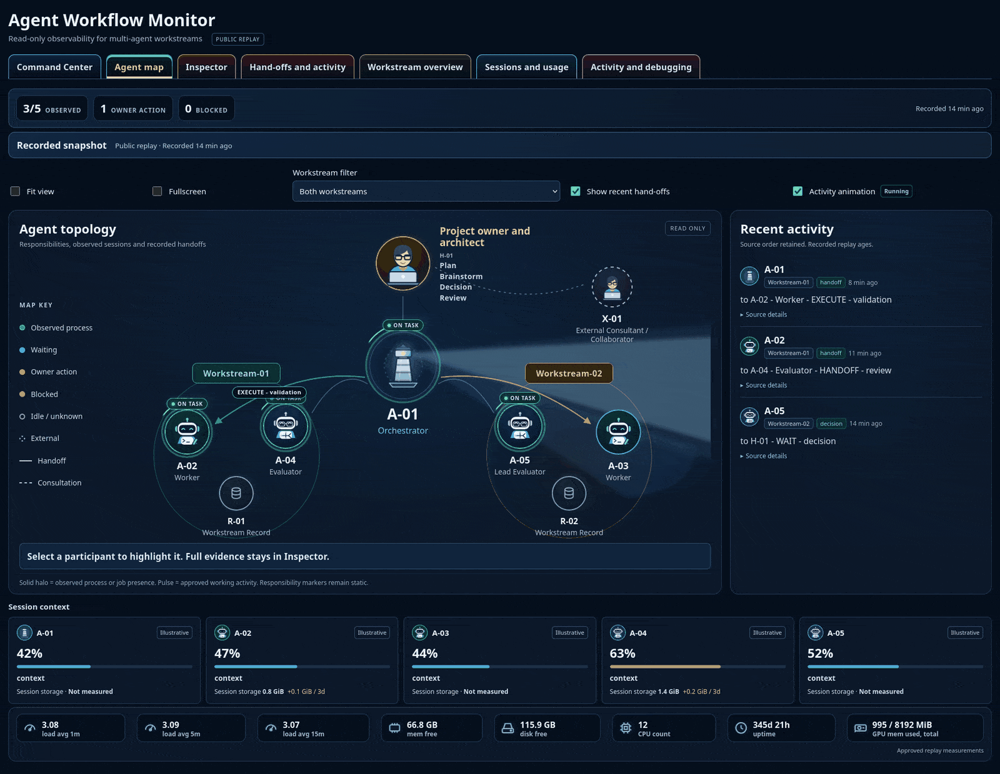

# Agent Workflow Monitor

Agent Workflow Monitor is a local-first operations cockpit for multi-agent workflows.

Monitor roles, workstreams, handoffs, context pressure, session storage, activity, logs, and machine health at a glance.
The monitor is deterministic and code-based: it makes no LLM calls of its own and uses your existing terminals, IDEs, CLIs, and agent interfaces for control.

## Why this exists

Multi-agent work becomes an operations problem surprisingly quickly. Once several workers, evaluators, external collaborators, and workstreams move in parallel, the important questions are no longer only "what did one agent say?" but also:

- Who is active?
- Who is waiting?
- Where did a handoff stall?
- Which session is under pressure?
- Is storage changing?
- Is the host healthy?

Agent Workflow Monitor provides one operational view across those signals so you can spot stale activity, blocked flow, and infrastructure risk faster.



## What you see at a glance

| Signal | What it tells you |
|---|---|
| Agent topology | Roles, ownership, collaboration, and workstream membership |
| Activity & handoffs | Who is working, waiting, reviewing, or passing work |
| Context usage | Session pressure when a valid denominator is known |
| Session storage | Current footprint and signed growth / decline |
| Workstream records | Progress and recent operational history |
| Host telemetry | CPU, memory, disk, uptime, and GPU pressure |
| Human action | Decisions and interventions that should remain visible |
| Evidence state | Measured, configured, stale, waiting, blocked, unknown |

## Why this monitor is different

- Human-supervised: project owner remains visibly distinct from orchestrators, workers, evaluators, and external collaborators.
- Workflow-level, not only trace-level: focus on responsibilities, workstreams, handoffs, context/storage pressure, and host health.
- Truthful evidence semantics: observed, configured, stale, waiting, blocked, and unknown are all separated and shown explicitly.
- Token-free monitoring path: deterministic presentation and projection without model inference.
- Provider-neutral public contract: PublicSnapshot and published roles are not tied to one model vendor.
- Privacy-aware replay: private workflow data is transformed into an allowlisted public snapshot for replay.

Designed to reduce manual log checking, context switching, and operational ambiguity:
surface blockers, stale sessions, missing measurements, handoff delays, context pressure, storage growth, and host-resource pressure quickly.

## 60-second public replay

Open the public replay in two steps:

```bash
python -m http.server 8765 --bind 127.0.0.1 --directory demo/static
```

Then open: [http://127.0.0.1:8765/](http://127.0.0.1:8765/)

This is a recorded/generalized replay derived from the public snapshot.

## Run your own local monitor

### Linux/macOS

```bash
python -m venv .venv
source .venv/bin/activate
python -m pip install -e ".[dev]"
python scripts/validate_config.py config/example.yaml
python scripts/run_local.py --config config/example.yaml
```

### Windows (PowerShell)

```powershell
python -m venv .venv
. .venv\Scripts\Activate.ps1
python -m pip install -e ".[dev]"
python scripts/validate_config.py config/example.yaml
python scripts/run_local.py --config config/example.yaml
```

## Observability without taking over your workflow

Control stays where you already work.
The monitor stays focused on observability:

- reads approved snapshot data from local files,
- never starts, retries, approves, deletes, kills, or submits work,
- does not run or control execution actions for your agents.

## Fits around your existing agent stack

Current reality in this repository:

- v0.1 complete application input is a strict `PublicSnapshot`.
- Provider/framework integrations are not shipped as complete top-level live sources unless explicitly implemented.
- Adapter utilities and agent skills help normalize new sources into the same public contract.

You may connect framework events through adapters that emit the documented public contract.
Frameworks such as LangChain/LangGraph are not bundled as first-party v0.1 live adapters; adapters can map framework lifecycle events into the documented `PublicSnapshot` contract.

Useful source families for adapters:

- append-only workflow logs
- agent lifecycle events
- process/job telemetry
- scheduler state
- context/session measurements
- host metrics

## Architecture and data boundary

```text
Authorized workflow data
        ->
Read-only adapter / exporter
        ->
Strict PublicSnapshot
        ->
Shared presentation projection
        ->
Agent Workflow Monitor
```

For public replay:

```text
Private workflow
        ->
Allowlisted export
        ->
Generalized snapshot
        ->
Public replay
```

See [architecture](docs/architecture.md), [data contract](docs/data-contract.md), and [privacy boundary](PRIVACY_BOUNDARY.md).

## Adapt it with Agent Skills

The monitor is the product; the skills help you adapt it to your workflow.

Install them into your target project in one step:

```bash
python scripts/install_skills.py --target /path/to/your/project
```

For a safe preview:

```bash
python scripts/install_skills.py --target /path/to/your/project --dry-run
```

If your project has only one skill needed:

```bash
python scripts/install_skills.py --target /path/to/your/project --skill configure-agent-workflow-monitor
```

| Skill | Ask your agent to... |
|---|---|
| `configure-agent-workflow-monitor` | "Configure Agent Workflow Monitor for this project." |
| `add-agent-workflow-adapter` | "Connect this workflow log or source to Agent Workflow Monitor." |
| `customize-agent-workflow-monitor` | "Adapt the roles and presentation for this team." |
| `audit-agent-workflow-release` | "Audit this monitor package before I publish it." |

Agents that do not automatically scan `skills/` can use the installer below to copy the
bundled skill folders into `.agents/skills/`:

```powershell
python scripts/install_skills.py --target C:/path/to/your/project
```

```text
my-project/
└── .agents/
    └── skills/
        ├── configure-agent-workflow-monitor/
        ├── add-agent-workflow-adapter/
        ├── customize-agent-workflow-monitor/
        └── audit-agent-workflow-release/
```

`install_skills.py` is conservative:

- validates each bundled `SKILL.md`,
- checks for existing target skills and refuses overwrites,
- defaults to copy (not symlinks),
- supports dry-run and skill filtering,
- does not access the network.

Skills are helpful, not required, for manual setup.

## Privacy model

- Public-facing artifacts are derived from allowlisted data.
- Absolute paths, source payloads, and raw workflow identities are not rendered in the monitor.
- Replay artifacts are separated from private live sources by the projection boundary.

For checks and policy details, see [PRIVACY_BOUNDARY.md](PRIVACY_BOUNDARY.md).

## Configuration

Use `config/example.yaml` with `python scripts/validate_config.py config/example.yaml`.

## Current scope & extension path

- Opinionated v0.1 topology: current renderer intentionally supports the documented seven public slots and two workstreams so v0.1 is visually tested and semantically explicit.
- Snapshot-first contract: strict PublicSnapshot inputs are deterministic, auditable, provider-neutral, and privacy-reviewable.
- Adaptable through configuration and skills: map your own role labels, evidence, metrics, and source adapters into the supported contract.
- Broader topology is the next presentation layer: arbitrary agent/workstream cardinality is roadmap, not current functionality.
- Observability-only control boundary: keeping the monitor outside execution authority is a design principle.

## Development and testing

```bash
python -m pytest
python scripts/validate_config.py config/example.yaml
python scripts/build_demo.py
python scripts/audit_public_candidate.py . --allowlist release_allowlist.txt --staged
python scripts/browser_demo_audit.py
```

The browser check requires local Firefox/geckodriver and is reported as untested when unavailable.

## Security

See [SECURITY.md](SECURITY.md) and [PRIVACY_BOUNDARY.md](PRIVACY_BOUNDARY.md).

## Roadmap

- Broaden topology and cardinality support.
- Expand adapter coverage for additional workflow ecosystems.
- Continue improving deterministic replay and presentation validation workflows.

## License

MIT License. See [LICENSE](LICENSE) for details.

## Acknowledgments

Thanks to the contributors and local toolchain that keep this monitor practical, deterministic, and reviewable.
