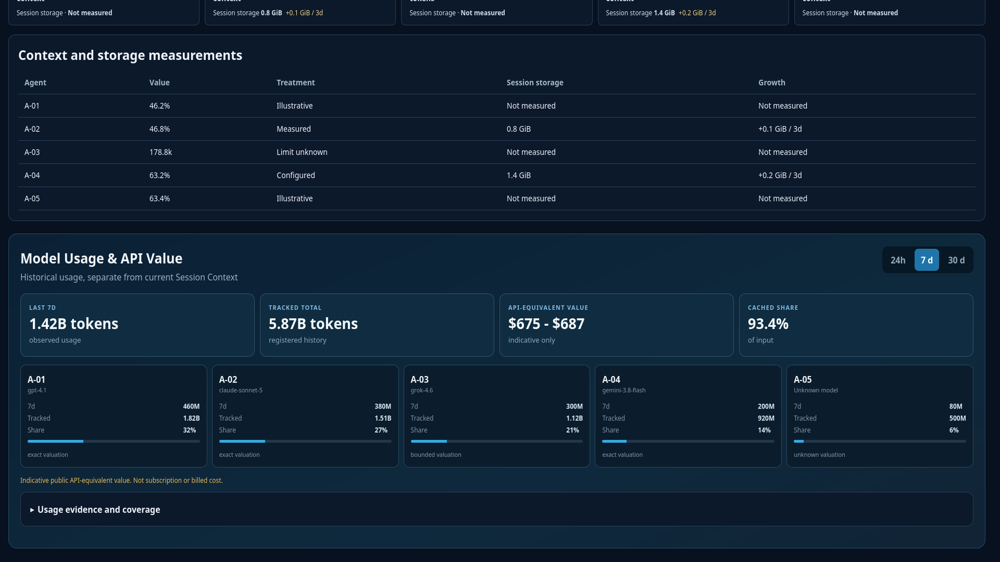
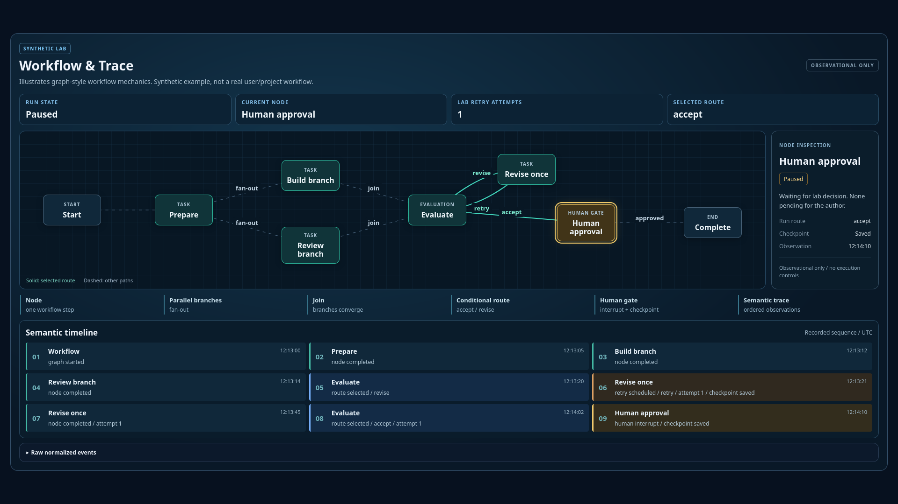

# Agent Workflow Monitor

Agent Workflow Monitor is a local-first operations cockpit for multi-agent workflows.

It gives project owners one mature, read-only view of organization, handoffs, current context pressure, historical model usage, indicative API-equivalent value, workflow execution, session storage, and host health. Monitoring is deterministic and makes no LLM calls of its own.

## Why this exists

Multi-agent work becomes an operations problem quickly. The useful questions span several layers: who owns the work, which handoff is active, what the workflow permits, what happened in this run, whether context is under pressure, and how much registered model usage has accumulated.

## What you see at a glance

- Command Center: compact operational summary.
- Agent map: seven-role organizational topology and animated activity cues.
- Inspector: detailed evidence without overloading compact cards.
- Hand-offs and activity: chronological public-safe operational events.
- Sessions and usage: current context pressure plus separate historical model usage.
- Workflow & Trace: provider-neutral workflow structure and one execution replay.
- Resources: context, tokens, API-equivalent value, storage, and host telemetry.

## Usage and API-equivalent value

The compact panel shows 24 h, 7 d, 30 d, and tracked-total usage, coverage, cached share, and per-agent/model rows.

API-equivalent values are indicative estimates calculated from reviewed public API rates. They are not subscription charges or invoices.

The monitor distinguishes API-equivalent value, provider-reported usage value, actual billed cost, subscription fee, and unknown evidence. See [cost semantics](docs/cost-semantics.md) and the [pricing registry](docs/pricing-registry.md).

## Workflow & Trace

The synthetic example illustrates graph-style mechanics familiar from LangGraph: nodes fan out into parallel branches, join at evaluation, follow a conditional route, and pause at a checkpointed human gate. Numbered trace cards show the recorded sequence. Select a node to inspect its recorded state; the monitor provides no execution controls.

Organization says who owns what. Workflow says what can happen. Execution Trace says what happened or is happening. Resources show tokens, API-equivalent value, context, storage, and host telemetry.

Workflow & Trace is runtime-neutral. LangGraph is one optional example producer of the normalized workflow/event contract; it is not a monitor dependency.

## Why this monitor is different

- Local-first and self-contained.
- Observational only: no launch, retry, approval, resume, kill, submit, or deletion controls.
- Truthful evidence states: measured, configured, stale, unknown, and not measured stay distinct.
- Provider-neutral schemas with optional framework adapters.
- Public-safe replay built from fictional fixtures.
- Strict allowlist, privacy scan, deterministic archive, and reusable Agent Skills.

## Try the public-safe replay locally

    python -m http.server 8765 --bind 127.0.0.1 --directory demo/static

Open http://127.0.0.1:8765/.

## Run your own monitor

    python -m venv .venv
    source .venv/bin/activate
    python -m pip install -e ".[dev]"
    python scripts/validate_config.py config/example.yaml
    python scripts/run_local.py --config config/example.yaml

The v0.1 PublicSnapshot remains accepted. v0.2 adds optional model_usage and workflow_graph sections, so pricing and workflow traces are not required.

## Fits around your agent stack

Adapters normalize approved local metadata into the public contract. The monitor does not require a cloud service or automatic upload. See [data contract](docs/data-contract.md), [workflow contract](docs/workflow-trace-contract.md), and [adapter guide](docs/workflow-adapters.md).

Bundled pricing is a reviewed snapshot, not a live billing service. Model launch and retirement boundaries are effective-dated from official evidence; ambiguous schedule history begins at the conservative review date. Use the pricing-update Skill to review newer official rates.

## Agent Skills

    python scripts/install_skills.py --target /path/to/project --dry-run

- configure-agent-workflow-monitor
- add-agent-workflow-adapter
- customize-agent-workflow-monitor
- audit-agent-workflow-release
- update-model-pricing-registry
- add-workflow-trace-adapter

Skills are optional and install conservatively without network access.

## Privacy

Public artifacts exclude private identities, paths, sessions, logs, payloads, runtime databases, credentials, and scientific/project data. Read [PRIVACY_BOUNDARY.md](PRIVACY_BOUNDARY.md).

## Current scope and roadmap

v0.2 keeps the accepted seven-slot, two-workstream organizational topology and adds optional historical usage and generic workflow replay. Arbitrary topology cardinality, live billing integrations, subscription allocation, and broad framework adapters remain future work.

## Development

    python -m pytest
    python scripts/validate_config.py config/example.yaml
    python scripts/validate_pricing_registry.py
    python scripts/validate_workflow_trace.py
    python scripts/build_demo.py
    python scripts/audit_public_candidate.py . --allowlist release_allowlist.txt --staged
    python scripts/browser_demo_audit.py

## License

MIT License. See [LICENSE](LICENSE).
